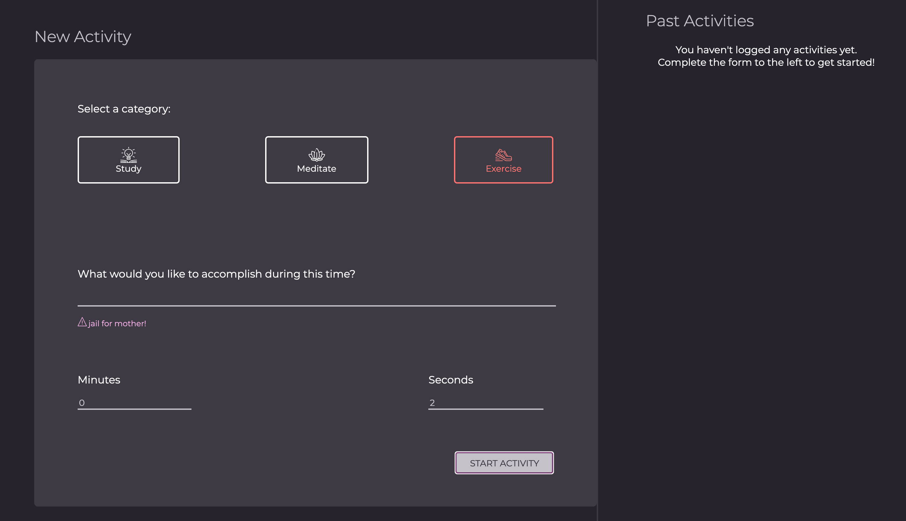
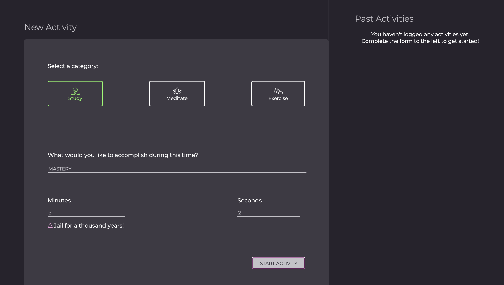
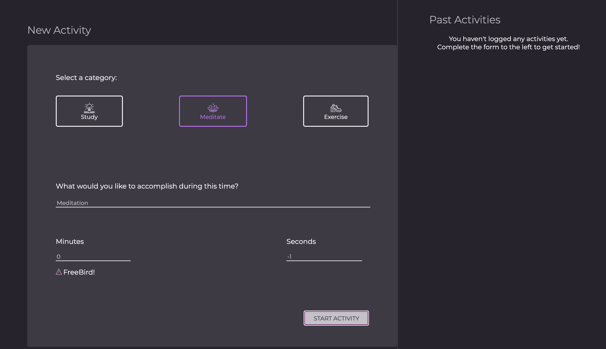
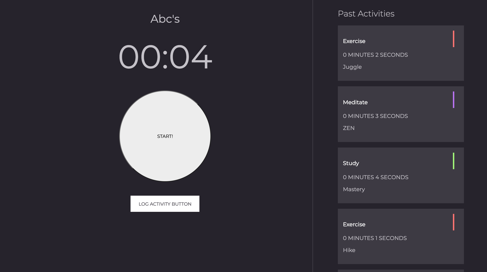
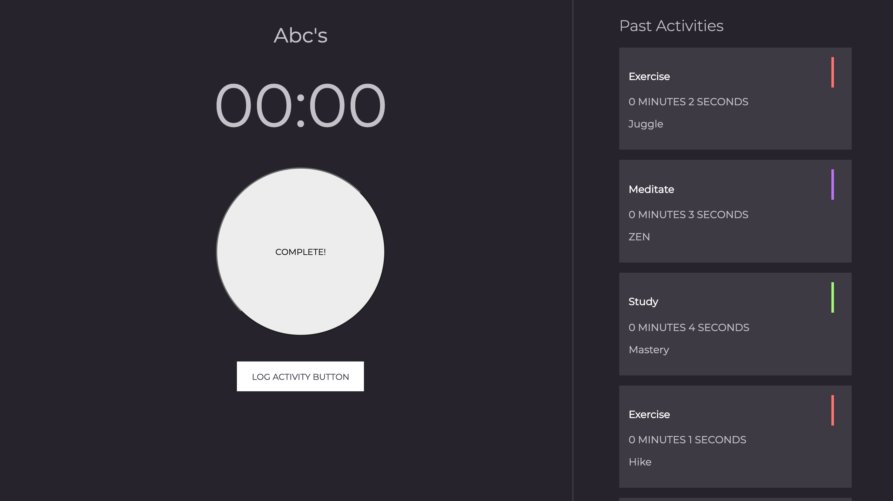
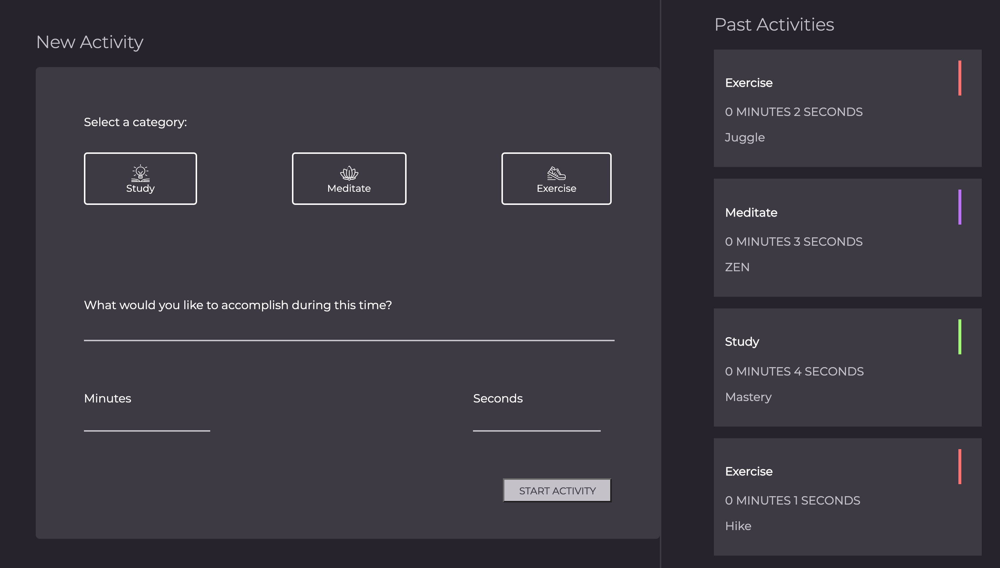
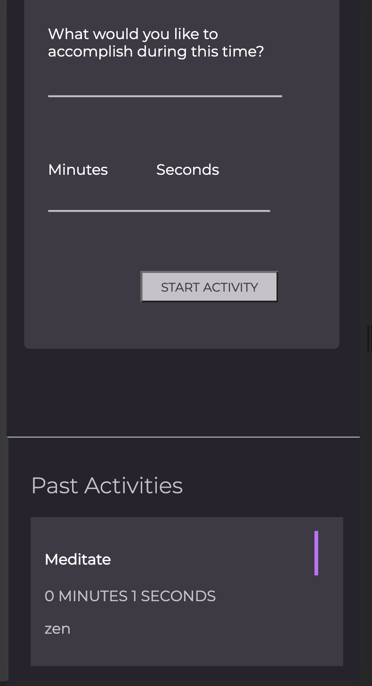

# Intention Timer Group Project

### Project Description ###

This was a group project that was designed to utilize and store intentions. A user can input a category, description, and a time that counts down to zero. The user inputs are saved to a card and can be referenced any time. The page is responsive and can be used on different sized devices. The cards persist in local storage when the page reloads.

## Learning Goals ##

* Create a functioning website with the use of HTML, CSS and JavaScript.
* Use variables, event listeners, event handlers, classes and functions to allow navigation through the webpage.
* Use a class and its methods. Create new object instances using the `new` keyword.
* Use media queries in order to have a mobile responsive site.
* Utilize local storage so that our intentions persist across browsers.
* Attempt to have very clean JavaScript and CSS code and refactor whenever possible with a goal of readability.
* Become familiar with the use of GitHub and branching when working on a group project.

## Planning: ##

The paired project was created using Atom as a text editor and Trello as a project management tool. We referenced MDN docs, css tricks and lesson plans for information. Consulted peers and mentors for support. Our [remote repository](https://github.com/BrigetteDoelp/intention-timer) is stored on GitHub.

This was a 7-day paired project.

**Challenges**

* Mastering the GitHub workflow with many branches and multiple group members.
* This project was completed during a time of civil unrest, which affected the members of the team. One of the team members was absent for a substantial part of the project.
* Creating a smooth transition between desktop and mobile views with input areas while using media queries.
* At times, connectivity problems made it difficult for team members to communicate effectively.

**Wins**

* Working with CSS and JS in a collaborative environment while working under deadlines.
* Learning and managing local storage.
* Teamwork that lead to professional development growth.
* Although we would have liked more time to refactor, we are proud of the code we wrote and our app is working as expected through Iteration 5.

## In Action/Functionality ##

**Main page functionality:**
* When an activity category is clicked on (Exercise, Meditate, or Study), the associated border and icon should change colors to give a visual indication that it has been selected. An input field should be provided for What would you like to accomplish during this time?

*  A Start Activity button is provided to submit the data entered into the form. The user should no longer see the form, and instead see a timer clock. The timer clock should display the user-provided minutes and seconds, as well as the description.

* If the Start Activity button is clicked before the user has entered information into all four inputs, the user will receive an error message, but will not lose any information that was provided.

**Timer Functionality**

* The user can start the time by clicking Start.
While timer is running, the user should see it count down by second.

* When the timer completes, the alert no longer appears.
Instead, a motivational or congratulatory message appears on the left side of the page, replacing the timer.

* When the user acknowledges the message and completion of the activity by clicking Log Activity, a card with the category, time, and the users input for What would you like to accomplish during this time? should appear on the card. The card should also have a small color-coded visual indicator of the category.

**Mobile responsive**

# Programming Languages Used #

HTML
CSS
JavaScript

**Built With:**
* Vanilla JavaScript
* HTML and CSS provided by [Turing Mod 1 Instructors](https://github.com/letakeane)

**Comps Given**

https://frontend.turing.io/projects/module-1/intention-timer-group.html

**Contributors:**

* [Amy Karnaze](https://github.com/amykarnaze)
* [Naomi Ware](https://github.com/nware1066)
* [Brigette Doelp](https://github.com/BrigetteDoelp)

# Additional Links: #

* [DTR](https://gist.github.com/BrigetteDoelp/6d6a9f6defd7ae4a11f0dadfd37c689b)
* [Trello](https://trello.com/b/x2TCfmoZ/intention-timer)
* [Project page]()
* [GitHub Link](https://github.com/BrigetteDoelp/intention-timer)
* Clone Me (SSH):
